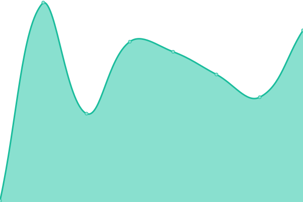
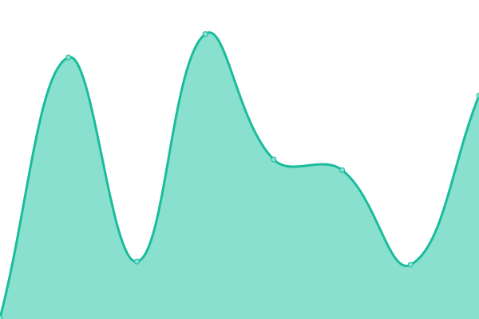
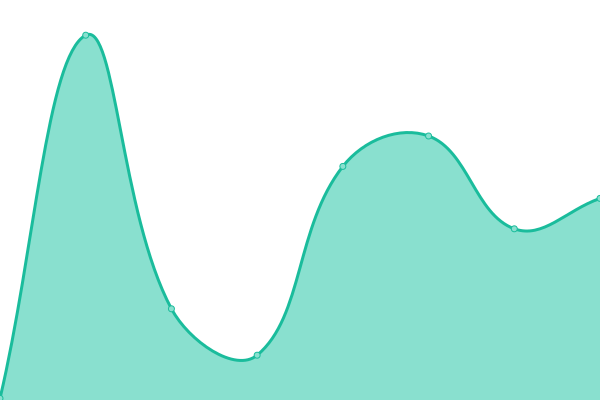

# [📈 Live Status](https://upptime.github.io/upptime): <!--live status--> **🟩 All systems operational**

<!--start: status pages-->
<!-- This summary is generated by Upptime (https://github.com/upptime/upptime) -->
<!-- Do not edit this manually, your changes will be overwritten -->
<!-- prettier-ignore -->
| URL | Status | History | Response Time | Uptime |
| --- | ------ | ------- | ------------- | ------ |
|  [Portfolio](https://www.danielcg.dev) | 🟩 Up | [portfolio.yml](https://github.com/danielcgilibert/upptime/commits/HEAD/history/portfolio.yml) | 

 253ms
     
 | 

<a href="https://status.danielcg.dev/history/portfolio">100.00%</a>
    

|  [Filmoteca](https://filmoteca-994ba.web.app) | 🟩 Up | [filmoteca.yml](https://github.com/danielcgilibert/upptime/commits/HEAD/history/filmoteca.yml) | 

 97ms
     
 | 

<a href="https://status.danielcg.dev/history/filmoteca">100.00%</a>
    

|  [Fiber Landing Page](https://danielcgilibert.github.io/Fiber-Landing-Page) | 🟩 Up | [fiber-landing-page.yml](https://github.com/danielcgilibert/upptime/commits/HEAD/history/fiber-landing-page.yml) | 

 150ms
     
 | 

<a href="https://status.danielcg.dev/history/fiber-landing-page">100.00%</a>
    

|  [Chart Component](https://challenges-fronted-mentor-chart-component-qah2e7rdt.vercel.app/) | 🟩 Up | [chart-component.yml](https://github.com/danielcgilibert/upptime/commits/HEAD/history/chart-component.yml) | 

 123ms
     
 | 

<a href="https://status.danielcg.dev/history/chart-component">100.00%</a>
    

|  [Card Component](https://cfm-productreview-cnax6r9nn-danielcgilibert.vercel.app/) | 🟩 Up | [card-component.yml](https://github.com/danielcgilibert/upptime/commits/HEAD/history/card-component.yml) | 

 144ms
     
 | 

<a href="https://status.danielcg.dev/history/card-component">100.00%</a>
    

<!--end: status pages-->

## 📄 License

- Powered by: [Upptime](https://github.com/upptime/upptime)
- Code: [MIT](./LICENSE) © [Upptime](https://upptime.js.org)
- Data in the `./history` directory: [Open Database License](https://opendatacommons.org/licenses/odbl/1-0/)
